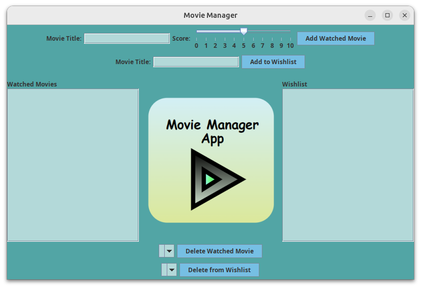
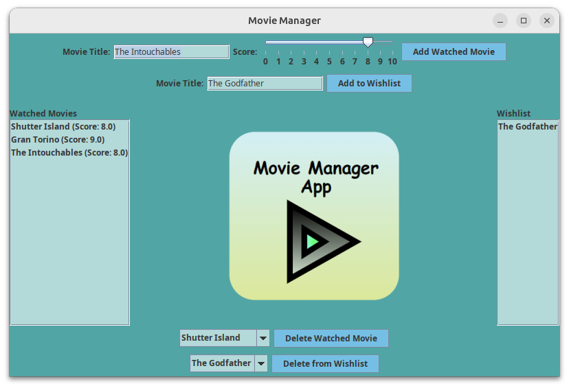

# Movie-Manager-App

Java desktop application designed to handle both viewed and unwatched movies. When we execute the moviemanager.jar the app is started showing the following window:

We can add watched movies with the score we think they deserve from 1 to 10 and add movies we want to watch later.

